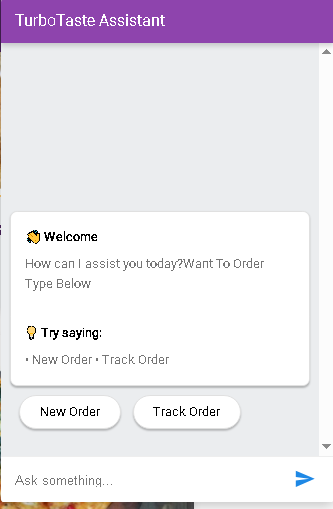
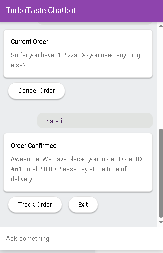
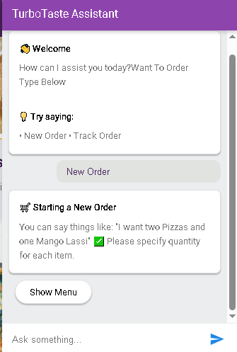
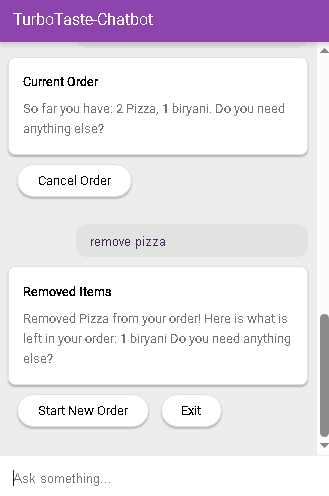

# TurboTaste Chatbot

**TurboTaste** Order Bot is the backend logic for a Dialogflow-powered virtual assistant that helps users place, modify, track, and cancel fast food orders in real-time. The bot uses a FastAPI application that connects to your fast food business database.

##  Features

- Add, remove, or cancel items in an order
- Track order status via order ID
- Complete orders and store them in the database
- Session-based order management
- Rich responses compatible with Dialogflow Messenger
- modular code structure

##  Project Structure

```
project/
├── main.py
├── db_helper.py
├── genric_helper.py
├── requirements.txt
├── screenshots/
└── README.md
```

- **main.py** – FastAPI app and core chatbot logic
- **db_helper.py** – Database operations for orders and tracking
- **genric_helper.py** – Helper functions (session ID, formatting, etc.)
- **requirements.txt** – Python dependencies


## Overview

Expects Dialogflow webhook JSON payload.  
Handles these intents:
- Add to Order
- Remove from Order
- Complete Order
- Track Order
- Cancel Order


## Customization

- Add menu validation, allergy warnings, promo codes, or payment links.
- Adjust intent-handler mapping in `main.py` for new flow.
- Refine `db_helper.py` for your preferred database (MySQL, PostgreSQL, SQLite, etc).

## Screenshots

    **Welcome Screen**
 


    **Order Confirmation**



    **Tracking Order**



    **Adding Extra Items**    


    **Removing item from order**



    **Tracking Order**


## Code Snippet
   **Adding Order**
   ```
def add_to_order(parameters: dict, session_id: str):
    Food_item    = parameters['Food_item']
    quantity = parameters['number1']

    # Check if the length of food items and quantities match
    # If they don't match, return an error message
    if len(Food_item) != len(quantity):
        fulfillment_text = "Sorry I didn't understand. Can you please specify food items and quantities clearly?"
    else:
        new_food_dict = dict(zip(Food_item, quantity))

        # If the session ID is not in in-progress orders, create a new order
        # If the session ID is already in in-progress orders, update the existing order
        if session_id in inprogress_orders:
            current_food_dict = inprogress_orders[session_id]
            current_food_dict.update(new_food_dict)
            inprogress_orders[session_id] = current_food_dict
        else:
            inprogress_orders[session_id] = new_food_dict
    # Generate a string representation of the current order
        order_str = genric_helper.get_str_from_food_dict(inprogress_orders[session_id])
        fulfillment_text = f"So far you have: {order_str}. Do you need anything else?"


    return JSONResponse(content={
    "fulfillmentMessages": [
        {
            "payload": {
                "richContent": [
                    [
                        {
                            "type": "info",
                            "title": "Current Order",
                            "subtitle": fulfillment_text
                        },
                        {
                            "type": "chips",
                            "options": [
                                {"text": "Cancel Order"}
                            ]
                        }
                    ]
                ]
            }
        }
    ]
})
```

   

## Requirements


## Setup & Run Locally

1. **Clone the repository**
    ```bash
    git clone https://github.com/yourusername/turbotaste-chatbot-backend.git
    cd turbotaste-chatbot-backend
    ```

2. **Install dependencies**
    ```bash
    python3 -m venv venv
    source venv/bin/activate
    pip install -r requirements.txt
    ```

3. **Configure**  
   Edit `db_helper.py` with your database details.

4. **Run the FastAPI app**
    ```bash
    uvicorn main:app --reload
    ```

5. **Link to Dialogflow Webhook**
    - In Dialogflow Console, use your running endpoint (e.g., `http://localhost:8000/` or your deployed URL) as the webhook for fulfillment.

## Credits

- [FastAPI](https://fastapi.tiangolo.com/) framework
- [Dialogflow](https://dialogflow.cloud.google.com/) for NLU and conversation flow
- See `db_helper.py` and `genric_helper.py` for business logic customizations
