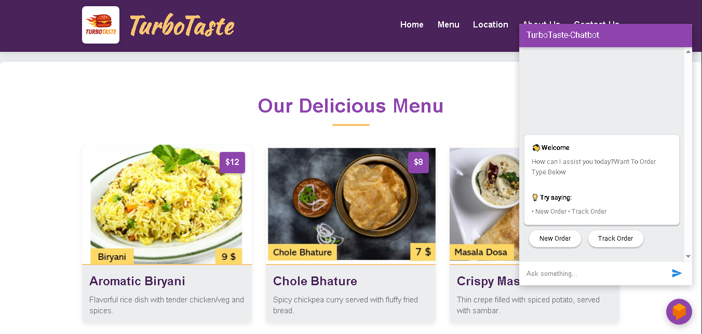
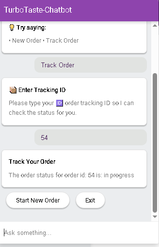

# TurboTaste Chatbot

**TurboTaste** Order Bot is the backend logic for a Dialogflow-powered virtual assistant that helps users place, modify, track, and cancel fast food orders in real-time. The bot uses a FastAPI application that connects to your fast food business database.

##  Features

- Add, remove, or cancel items in an order
- Track order status via order ID
- Complete orders and store them in the database
- Session-based order management
- Rich responses compatible with Dialogflow Messenger
- modular code structure

##  Project Structure

```
project/
├── main.py
├── db_helper.py
├── genric_helper.py
├── requirements.txt
├── screenshots/
└── README.md
```

- **main.py** – FastAPI app and core chatbot logic
- **db_helper.py** – Database operations for orders and tracking
- **genric_helper.py** – Helper functions (session ID, formatting, etc.)
- **requirements.txt** – Python dependencies


## Overview

Expects Dialogflow webhook JSON payload.  
Handles these intents:
- Add to Order
- Remove from Order
- Complete Order
- Track Order
- Cancel Order
- Show Menu


## Screenshots

   **Starting Page**



   **Welcome Screen**

   
 


   **Order Confirmation**


   


   **Tracking Order**


   


   **Adding Extra Items**    


   


   **Removing item from order**


   


   **Tracking Order**

   



## Requirements

Python==3.13

fastapi==0.115.12

fastapi-cli==0.0.7

email_validator==2.2.0

Jinja2==3.1.6

mysql-connector-python==9.3.0

uvicorn==0.34.3


## Setup & Run Locally

1. **Clone the repository**
    ```bash
    git clone https://github.com/yourusername/turbotaste-chatbot-backend.git
    cd turbotaste-chatbot-backend
    ```

2. **Install dependencies**
    ```bash
    python3 -m venv venv
    source venv/bin/activate
    pip install -r requirements.txt
    ```

3. **Configure**  
   Edit `db_helper.py` with your database details.

4. **Run the FastAPI app**
    ```bash
    uvicorn main:app --reload
    ```

5. **Link to Dialogflow Webhook**
    - In Dialogflow Console, use your running endpoint (e.g., `http://localhost:8000/` or your deployed URL) as the webhook for fulfillment.

## Credits

- [FastAPI](https://fastapi.tiangolo.com/) framework
- [Dialogflow](https://dialogflow.cloud.google.com/) for NLU and conversation flow
- See `db_helper.py` and `genric_helper.py` for business logic customizations
- Special thanks to the [Codebasics YouTube channel](https://www.youtube.com/c/codebasics) for their clear tutorials and guidance—many of the concepts and practices in this project were learned from their excellent content.

